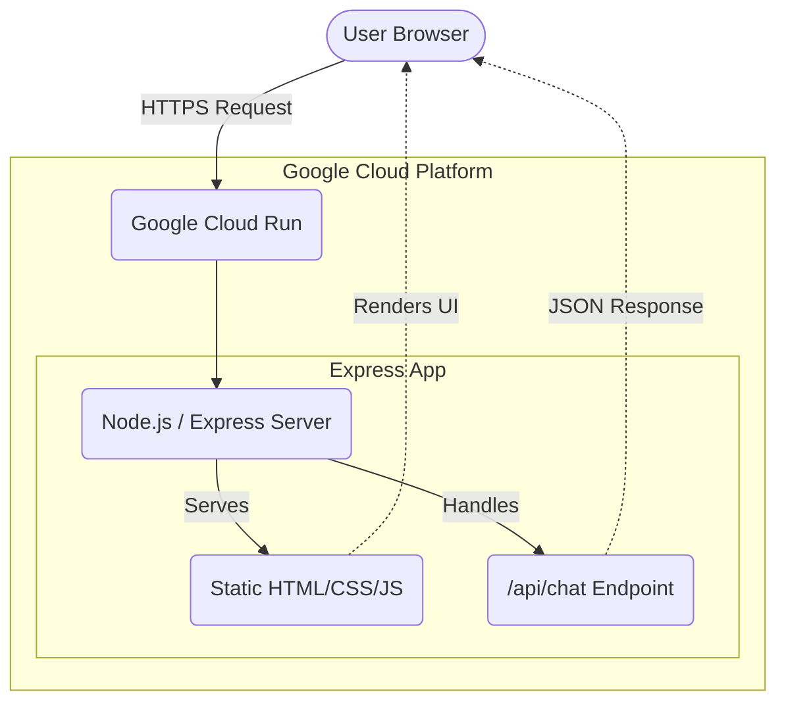
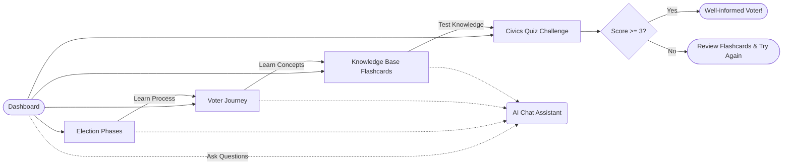

# 🇮🇳 Democracy Hub: Indian Election Assistant

**Live Demo:** [Democracy Hub on Cloud Run](https://election-assistant-1038527892656.us-central1.run.app)

Democracy Hub is an interactive, award-winning web application built to educate citizens about the **Indian Election System**. Navigating the world's largest democratic exercise can be complex, and this platform simplifies the process through interactive timelines, step-by-step guides, civics flashcards, quizzes, and an integrated AI Chat Assistant.

---

## ✨ Features

- **📊 Election Phases Timeline:** Visualizes the massive phased approach of Indian elections, from the announcement of the Model Code of Conduct to Counting Day.
- **🗺️ Voter Journey Guide:** A clear 5-step process for Indian citizens, covering everything from checking the Electoral Roll to using the EVM/VVPAT.
- **📇 Knowledge Base Flashcards:** Flipcards to learn key electoral concepts like ECI, Lok Sabha, EVM, VVPAT, and NOTA.
- **🏆 Civics Quiz:** Test your knowledge of the Indian electoral system with a 5-question interactive challenge featuring dynamic scoring.
- **🤖 ECI AI Assistant:** A floating chat widget programmed to answer specific questions regarding the Election Commission, voting mechanics, and voter eligibility.

---

## 🛠️ Technology Stack

- **Frontend:** Vanilla HTML5, CSS3 (Glassmorphism UI, Responsive Design), ES6 JavaScript
- **Backend:** Node.js, Express.js
- **Containerization:** Docker
- **Deployment:** Google Cloud Run, Google Cloud Build
- **Version Control:** Git & GitHub

---

## 📐 Architecture Diagrams

### System Architecture

This diagram illustrates how a user request is served by the Cloud Run instance and how the AI Assistant API is structured.



### User Journey & App Flow

This diagram shows how users interact with the various modules inside the Democracy Hub application.



---

## 🚀 How to Run Locally

### Prerequisites
- Node.js installed

### Steps
1. Clone the repository:
   ```bash
   git clone https://github.com/gauravpardeshi5051-star/Democracy-Hub.git
   cd Democracy-Hub
   ```
2. Install dependencies:
   ```bash
   npm install
   ```
3. Start the application:
   ```bash
   npm start
   ```
4. Open your browser and navigate to `http://localhost:8080`.

---

## ☁️ Deployment

This project is containerized using Docker and continuously deployed to **Google Cloud Run**.

1. **GitHub Push:** Code changes pushed to the `main` branch trigger Google Cloud Build.
2. **Cloud Build:** Cloud Build uses the provided `Dockerfile` to create a lightweight `node:20-slim` container image.
3. **Artifact Registry:** The image is pushed to the GCP Artifact Registry.
4. **Cloud Run:** The new image is deployed serverlessly, ensuring scalability and zero-downtime updates.